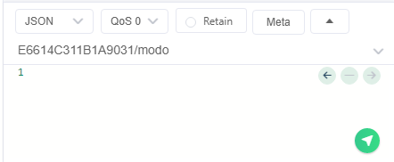

# Ejercicio Raspberry Pi Pico W

## Consideraciones:
El funcionamiento del código fue probado recibiendo mensajes en el formato JSON con la siguiente estructura.

Donde el mensaje recibido en este caso el valor 1 es un string.
Los parámetros que se espera recibir para los distintos topicos son:
- modo: 0 para manual y 1 para automático
- relé: 0 para desactivado y 1 para activado
- destello: 1 para el parpadeo del LED
- setpoint: número entero de temperatura
- periodo: número entero de periodo

## Consigna:
Programado en micropython utilizando asyncio.
Se comunica mediante mqtts.
Publica periódicamente en el tópico "ID_DEL_DISPOSITIVO" los siguientes parámetros: temperatura, humedad, setpoint, periodo y modo. Se envían todos las mediciones en una sola publicación en un JSON.
Se suscribe a "ID_DEL_DISPOSITIVO"/setpoint, "ID_DEL_DISPOSITIVO"/periodo, "ID_DEL_DISPOSITIVO"/destello, "ID_DEL_DISPOSITIVO"/modo e "ID_DEL_DISPOSITIVO"/relé.
Almacenará de manera no volátil los parámetros de setpoint, periodo, modo y relé (ver btree).
Destellará por unos segundos cuando reciba la orden "destello" por mqtt.
Cuando recibe un mensaje con nuevos parámetros no volátiles, deberá actualizar los almacenados y actuar si es necesario.
El código del programa deberá estar en un repositorio git cuya dirección debe figurar en la entrega del trabajo.
En modo automático:
El relé se accionará cuando se supere la temperatura de setpoint.
En modo manual:
El relé se activará según la orden "relé" enviada por mqtt.

